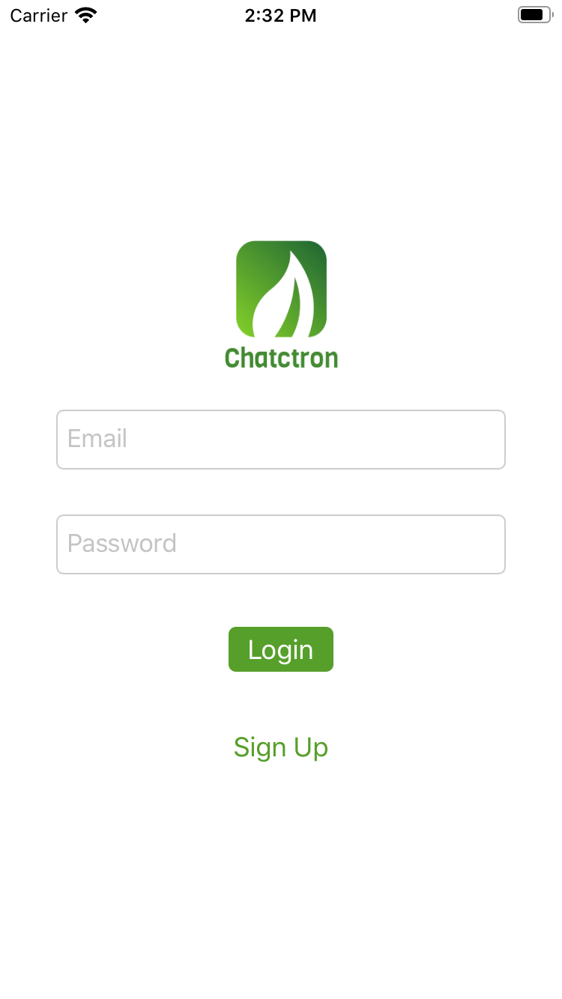
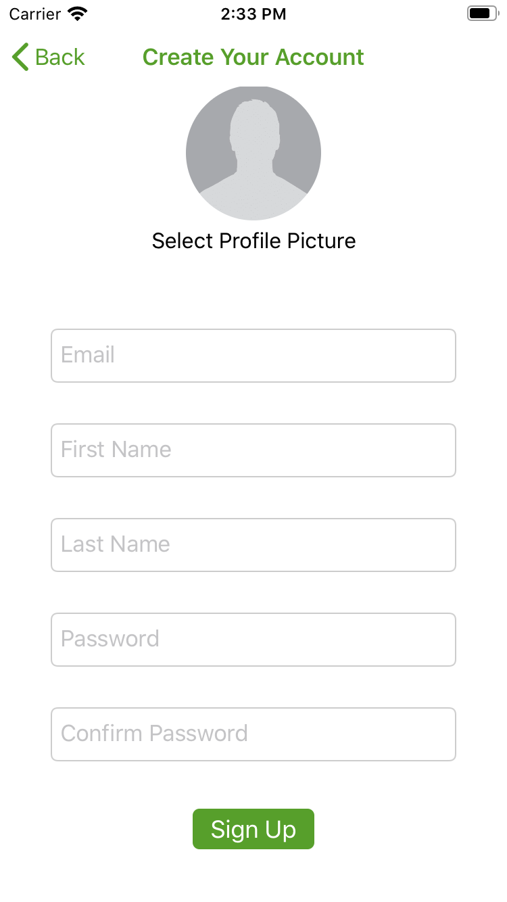
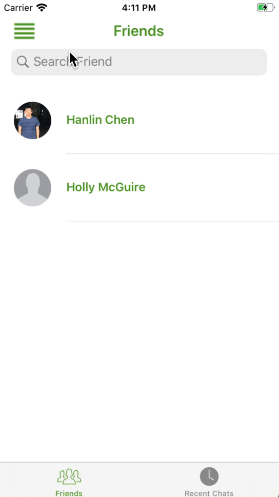
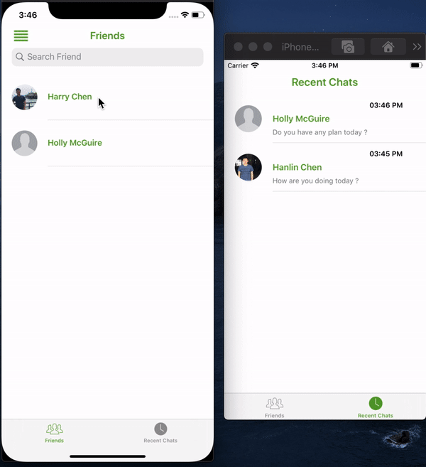

# Chatctron
Chatctron is a realtime ios chat application. Compared to traditional message app using socked.io, Chatctron is powered by google cloud firestore (NOSQL database) and ensures smooth communication between clients. Before using this app, users need to create an account and verified their email after registrations. User can safely login into the app with firebase authenticate backend service. 

## Login and Sign Up Page
Login Page             |  Sign Up page
:-------------------------:|:-------------------------:
|  |  |

## Slide Menu

## Realtime Messaging Demo 

